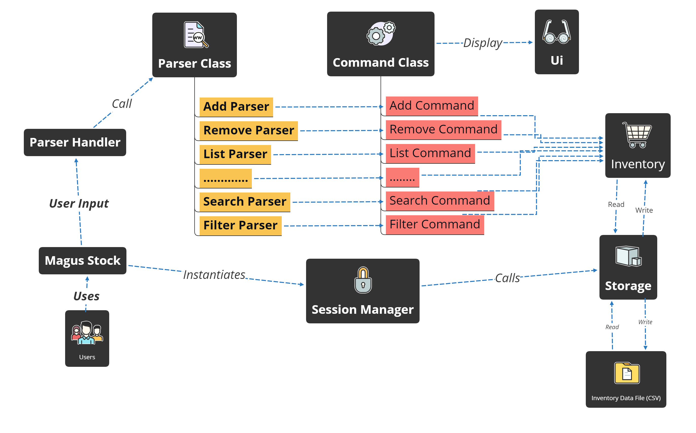
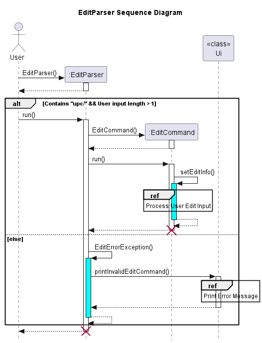
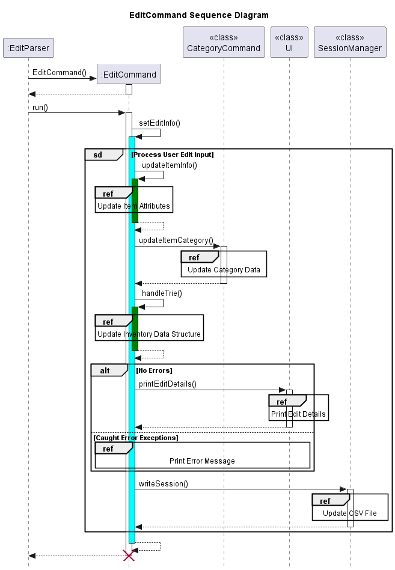
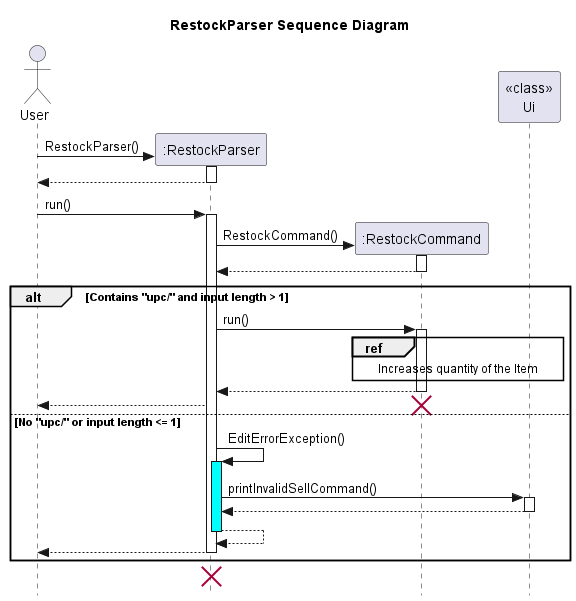
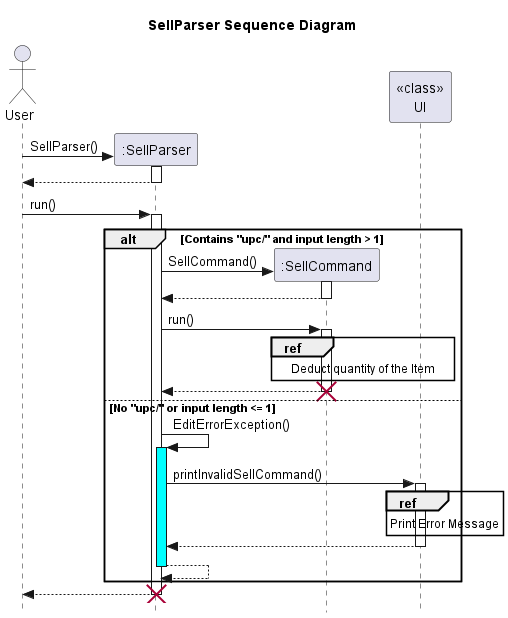
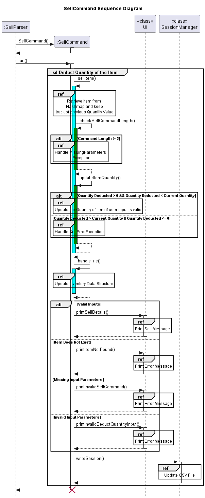
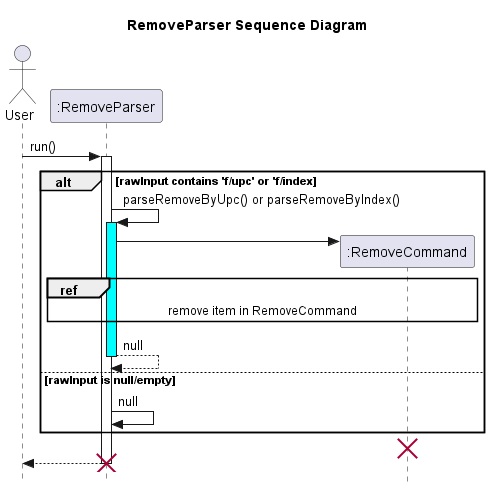
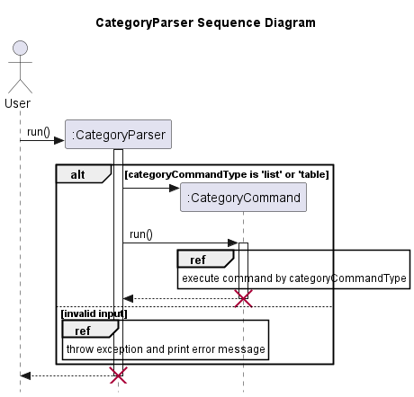

# Developer Guide

## Contents
- [Acknowledgements](#acknowledgements)
- [Design & Implementation](#design--implementation)
- [Implementation](#implementation)
  - [List](#list)
  - [Add](#add)
  - [Edit](#edit)
  - [Remove](#remove)
  - [Search](#search)
  - [Filter](#filter)
  - [Alert](#alert)
  - [History](#history)
  - [Category](#category)
- [Product Scope](#product-scope)
  - [Target User Profile](#target-user-profile)
  - [Value Proposition](#value-proposition)
- [User Stories](#user-stories)
- [Non-Functional Requirements](#non-functional-requirements)
- [Glossary](#glossary)
- [Instructions for Manual Testing](#instructions-for-manual-testing)

## Acknowledgements

The documentation and organisation of our project follows the recommended format as shown in [SE-Education](http://se-education.org/addressbook-level3/DeveloperGuide.html)

## 1. Design

### 1.1. Architecture Design Diagram

Breakdown of each component and its role in the application:

`MagusStock`: This is the entry point for the application, and it's responsible for starting the application and coordinating the interactions between the other components.

`ParserHandler`: This component is responsible for handling user input and determining which parser to execute based on the input. It uses a Parser to parse the input and generate a corresponding Command object.

`Parser`: This component is responsible for parsing the user input and generating a Command object. The ParserHandler uses the Parser to parse the input and determine which Command object to create.

`SessionManager`: This component is responsible for managing the inventory data persistence. It's connected to the Storage component, which reads and writes inventory data to and from a CSV file.

`Storage`: This component is responsible for reading and writing inventory data to a CSV file. It's connected to the SessionManager, which uses it to manage the inventory data persistence.

`Ui`: This component is responsible for displaying information to the user. It receives messages and data from the other components and displays them to the user.

Overall, the architecture diagram shows how the different components of the MagusStock application work together to provide the user with a command-line interface for managing an inventory of items. The components are designed to be modular and loosely coupled, allowing for easy modification and extension of the application.

### 1.2. UML Sequence Diagram

## 2. Implementation
### 2.1. List
The list command is mainly handled by the `ListCommand` class, which extends the `Command` class.

**Step 1**. When the user executes the command `list`, the `ParserHandler` will create a new `ListParser` object and pass to it the `Inventory` where the items to be listed are stored.

**Step 2**. The `run` method in `ListParser` overrides the `run` method in `Parser` to create a new `ListCommand` object, passing to it the relevant `Inventory`.

**Step 3**. The `run` method in `ListCommand` overrides the `run` method in `Command` and calls the `listItems` method. The `listItems` method checks if the inventory is empty. If the inventory is empty, the method prints a message to inform the user that there are no items in the inventory. Otherwise, the `printTable` method from the `Ui` object is called.

**Step 4.**. If the `printTable` method is called, it takes in an `ArrayList<Item> items` aas a parameter and prints out a table showing the name, UPC, quantity and price of all items in the inventory.

### 2.2. Add
The add command is mainly handled by the `AddCommand` and `AddParser` classes, which extends the `Command` and `Parser` 
class respectively.
#### 2.2.1. AddParser Class
The `AddParser` class is a parser class that extends the `Parser` abstract class. It handles the "add" command by parsing 
the user's input into separate input parameters using regular expressions. It then creates a new `Item` object with the 
parsed parameters and creates a new `AddCommand` object with the `Inventory` object and `Item` object as parameters.

The `AddParser` class has a constructor that takes in a `String` object representing the raw input from the user and an 
`Inventory` object representing the inventory. It passes these parameters to the constructor of the `Parser` abstract class.

The class contains an overridden `run()` method that first checks if the raw input is null or not. If it is null, it 
throws a `MissingParametersException`. Otherwise, it uses a regular expression matcher to match the raw input to a 
specific pattern. If the input doesn't match the pattern, it prints an error message and returns. If the input matches 
the pattern, it creates a new `Item` object using the parsed parameters and creates a new `AddCommand` object using the 
`Inventory` object and `Item` object. It then calls the `run()` method of the `AddCommand` object to execute the add command.

#### 2.2.2. AddCommand Class
The `AddCommand` class is a command class that extends the `Command` abstract class. It represents the command to add an 
item to the inventory. It contains a constructor that takes in an `Inventory` object and an `Item` object as parameters. 
The constructor sets the `Inventory` object to be the inventory of the `Command` class, and the `Item` object to be the item 
to be added to the inventory. The class also contains a private method called `addItem()` that adds the `Item` object to 
the inventory. The `addItem()` method checks if the item already exists in the inventory using its unique UPC 
(Universal Product Code) code. If the item already exists, it prints a message stating that the item is a duplicate. 
Otherwise, it adds the item to the inventory, updates the item name hash, and adds the item to the UPC code history. 
If the `SessionManager`'s `autoSave` flag is enabled, it writes the current inventory to a file using the `SessionManager`.

The `run()` method of the `AddCommand` class calls the `addItem()` method to execute the add command.

### 2.3. Edit
The "edit" command is mainly handled by the `EditCommand` class, which extends the `Command` class. It is parsed
by the `EditParser` class, which extends the `Parser` class.

**Step 1**. When the user executes the command `edit upc/[UPC Code] n/[Name] qty/[Quantity] p/[Price] c/[Category]`,
the `ParserHandler` will create a new `EditParser` object and pass the appropriate `input` and `Inventory` in which
the items are stored.

**Step 2**. The `EditParser` object checks for the validity of the `input`. If it is determined that no `upc/` is given
or only the `UPC` is given without additional parameters, an exception will be thrown for error handling. If none of
these conditions are met, an `EditCommand` object will be created to further process the user input.

**Step 3**. In the `EditCommand` object, the method `setEditInfo()` will be called first. This method will be used
to not only call other methods for user input processing, but will also handle the exceptions thrown by the other
methods it has called. It will begin by retrieving the item information from the inventory using
`retrieveItemFromHashmap()` and storing the item attribute information in three `Item` objects, namely `updatedItem`,
`oldItem` and `oldItemForCat`. `oldItem` will be used to keep track of the old attribute information, while 
`updatedItem` will be used to overwrite the old attributes, should the user inputs be valid. `oldItemForCat` will
exclusively be used for updating of category information.

**Step 4**. Still within the `setEditInfo()` method, `updatedItem` and `oldItem` will be pass into another method
`updateItemInfo()`. This method calls `handleUserEditCommand()` for further user input processing and also handles
a series of different exceptions thrown. Within `handleUserEditCommand()`, further verification of user input by
`validateUserEdtiCommand()` will take place, before allowing `makeEdits()` to be executed, which will change the
information in the `updatedItem` object and hence the attribute information of the item. Should exceptions be thrown 
by `validateUserEditCommands()`, attribute information stored by `oldItem` will be used by `revertChanges()` to 
update the item attributes instead.

**Step 5**. After item attributes have been updated, we go back to the `setEditInfo()` method, which will then update
the data structures responsible for tracking of the item  and its attributes using the `handleTrie()`, `remove()` and
`put()` methods.

Included below are UML Sequence Diagrams for `EditParser` and `EditCommand`. The second diagram shows a 
more detailed reference frame for `Process User Edit Input` found in the first diagram.

### 2.4. Restock
The `restock` command is mainly handled by the `RestockCommand` class, which extends the `Command` class. It is parsed 
by the `RestockParser` class, which extends the `Parser` class. Included below is a sequence diagram for the `restock`
command:

**Step 1**. When the user executes the command `restock upc/[UPC Code] qty/[Quantity]`, the
`ParserHandler` will create a new `RestockParser` object and pass the appropriate `input` and `Inventory` in which
the items are stored.

**Step 2**. The `RestockParser` object checks for the validity of the user inputs. If user inputs were determined to
be invalid due to lack of a UPC call `upc/` or wrong command length of `1` or below, an exception will be thrown for 
error handling. If both conditions as mentioned earlier are satisfied, a `RestockCommand` object will be created to 
handle the next step of user input processing.

**Step 3**. In the `RestockCommand` object, method `restockItem()` is called to begin item quantity addition process.
Two `Item` objects, `updatedItem` and `oldItem`, will be created for ease of passing information on the quantity of
the item before and after the update to other classes. Should `updatedItem` fail to retrieve item information from the
hashmap, possibly due to a non-existent UPC code, `Exception` will be thrown for error handling.

**Step 4**. The method `restockItem` calls the methods `checkRestockCommandLength()` and `updateItemQuantity()` for 
quantity addition. `checkRestockCommandLength()` checks whether the there are two string inputs and throws an 
`Exception` if the input is not exactly 2 strings long, before allowing `updateItemQuantity()` to perform the actual
addition. However, even within `updateItemQuantity()`, checks are also performed to detect for negative values, or
strings in place of actual integers. These checks will also throw an `Exception` for error handling.

**Step 5**. Hashmap and Tree data structures containing information about the Item will be updated, by taking
reference from the `oldItem` and `updatedItem` objects. The `UI` class will be called to handle output of strings
to inform the user on the status of the program, based on whether quantity addition has been done successfully or
if an `Exception` has been thrown.

Included below are UML Sequence Diagrams for the `RestockParser` and `RestockCommand`. The second diagram shows a more
detailed version of what happens in the reference frame of `Increase Quantity of the Item`.

### 2.5. Sell
The "sell" command is mainly handled by the `SellCommand` class, which extends the `Command` class. It is parsed
by the `SellParser` class, which extends the `Parser` class. 

**Step 1**. When the user executes the command `sell upc/[UPC Code] qty/[Quantity]`, the
`ParserHandler` will create a new `SellParser` object and pass to it the appropriate `input` and the appropriate
`Inventory` in which the items are stored.

**Step 2**. The `SellParser` object checks for the validity of the user inputs. If user inputs were determined to
be invalid due to lack of a UPC code or wrong command length of `1` or below, an exception will be thrown for error 
handling. If both conditions as mentioned earlier are satisfied, a `SellCommand` object will be created to handle
the next step of user input processing.

**Step 3**. In the `SellCommand` object, method `sellItem()` is called to begin item quantity deduction process.
Two `Item` objects, `updatedItem` and `oldItem`, will be created for ease of passing information on the quantity of
the item before and after the update to other classes. Should `updatedItem` fail to retrieve item information from the
hashmap, `Exception` will be thrown for error handling.

**Step 4**. The method `sellItem` calls the methods `checkSellCommandLength()` and `updateItemQuantity()` for quantity
deduction. `checkSellCommandLength()` checks whether the there are two string inputs and throws an `Exception` if the
input is not exactly 2 strings long, before allowing `updateItemQuantity()` to perform the actual deduction. However,
even within `updateItemQuantity()`, checks are also performed to detect for negative values, strings as quantities, or
values exceeding the total available quantity. These checks will also throw an `Exception` for error handling.

**Step 5**. Hashmap and Tree data structures containing information about the Item will be updated, by taking
reference from the `oldItem` and `updatedItem` objects. The `UI` class will be called to handle output of strings
to inform the user on the status of the program, based on whether quantity deduction has been done successfully or
if an `Exception` has been thrown.

Included below are UML Sequence Diagrams for `SellParser` and `SellCommand`. The second diagram gives a detailed
version of what happens in the reference frame 'Deduct Quantity of the Item'.

### 2.6. Remove

The remove command is mainly handled by the `RemoveCommand` class, which extends the `Command` class. It is parsed by the 
`RemoveParser` class, which extends the `Parser` class.

**Step 1**. When the user executes the command `remove f/index [Index]` or `remove f/item upc/[UPC]`, the `ParserHandler` will
create a new `RemoveParser` object and pass to it the appropriate `input`, and `inventory` in which the items are stored.

**Step 2**. The `run` method in the `RemoveParser` is called which overrides the `run` method in `Parser`. This leads the
`RemoveParser` to call either `parseRemoveByIndex` or `parseRemoveByUpc` method, depending on whether the `f/` is `f/index`
or `f/item` respectively. 

**Step 3**. The methods `parseRemoveByIndex` or `parseRemoveByUpc` will check the validity of the input. If user input is invalid,
an error message will be printed out and method execution will halt. Otherwise, both methods will print a confirmation message to 
the user, where the user will have to enter `Y` or `N` for the method to create a new `RemoveCommand` object to execute the removal. 

**Step 4**. The `run` method in `RemoveCommand` is called which overrides the `run` method in the `Command` object.
This calls either `removeByUpcCode` or `removeByIndex` method depending on the type identified earlier. Now, both functions
will check if the UPC or index input by user is valid/exists in the list. If not, an error message will be printed and method
will halt.

**Step 5**. The `removeByUpcCode` or `removeByIndex` method will check the confirmation input by user earlier. If user confirmation
is `Y`, the specified item will be removed from the inventory, remove any alerts for the item and `printSuccessRemove` 
from the `Ui` object will be called. If user confirmation is `N`, `printNotRemoving` from the `Ui` object will be called and method
will halt. If user confirmation is not valid, `printInvalidReply` from the `Ui` object will be called and method will halt. 

### 2.7. Search
The search command is mainly handled by the `SearchCommand` class, which extends the `Command` class. It is parsed by 
the `SearchParser` class, which extends the `Parser` class.

**Step 1**. When the user executes the command `search [keyword]` or `searchupc [keyword]`, the `ParserHandler` will create a 
new `SearchParser` object and pass to it the appropriate `input`, the `SearchType`, and the appropriate `Inventory` in 
which the items are stored.

**Step 2**. The `run` method in `SearchParser` is called which overrides the `run` method in `Parser`. This leads the 
`SearchParser` to call either the `parseSearch` or `parseSearchUPC` method, depending on whether the `SearchType` is
`Types.SearchType.KEYWORD` or `Types.SearchType.UPC` respectively.

**Step 3**. The methods `parseSearch` or `parseSearchUPC` will check the validity of the input, and if the input
is valid, both will create a new `SearchCommand` object, passing to it the relevant `Inventory`, `SearchType`, and 
the `input`. If the input is not valid, an error message will be printed out and method execution will halt.

**Step 4**. The `run` method in the `SearchCommand` object is called which overrides the `run` method in the
`Command` object. This calls either the `searchKeyword` method which returns `ArrayList<Item>`, or the `searchUPC`
method which returns an `Item` if there are found item(s), depending on whether the `SearchType` is 
`Types.SearchType.KEYWORD` or `Types.SearchType.UPC` respectively. Else, the methods will return `null`.

**Step 5**. The object(s) are returned to the `run` method. If the returned object is `null`, then the method
will inform the user that no search results were found. Otherwise, the `printSearchItems` or the 
`printSearchUPCItems` from the `Ui` object is called, depending on whether the `SearchType` is
`Types.SearchType.KEYWORD` or `Types.SearchType.UPC` respectively.

**Step 6**. If the `printSearchItems` method is called, it takes in an `ArrayList<Item> items` as a parameter and
prints out a table showing the name, UPC, quantity and price of all search results. Otherwise, the `printSearchUPCItems`
method takes in an `Item item` and prints it out in a table showing the name, UPC, quantity and price of the item.

### 2.8. Filter
The filter command is mainly handled by the `FilterCommand` class, which extends the `Command` class. It is parsed by
the `FilterParser` class, which extends the `Parser` class.

**Step 1**. When the user executes the command `filter f/[filtertype] p/[price type] [category/price/tag]`, the 
`ParserHandler` will create a new `FilterParser` object and pass to it the appropriate `input` and the appropriate
`Inventory` in which the items are stored.

**Step 2**. The `run` method in `FilterParser` is called which overrides the `run` method in `Parser`. This leads the
`FilterParser` to call either the `parseFilterCategory` or `parseFilterPrice` method, depending on whether the 
`f` flag is `category` or `tag` or `price` respectively. If the `f` flag is invalid, an error message is printed 
instead.

**Step 3**. The method `parseFilterCategory` will take the keyword from the user input, create a new `FilterCommand`
object and pass to it the relevant `Inventory`, `value` and `filterMode`. The `filterMode` is the `f` flag. The method 
`parseFilterPrice` will check if the `p` flag is set correctly. If it is not set correctly, an error message will be 
printed out and execution of the method will halt. Otherwise, a new `FilterCommand` object is created and passed the 
`Inventory`, `Price`, and `FilterPriceMode`.

**Step 4**. The `run` method in the `FilterCommand` object is called which overrides the `run` method in the
`Command` object. This calls either the `filterCategory` method or `filterPrice` which returns 
`ArrayList<Item>`, depending on the `filterMode`, which is set to either `filterMode` or `FilterPriceMode`. If there are no
filtered items, the methods will return `null`.

**Step 5**. The objects are returned to the `run` method. If the returned object is `null`, then the method
will inform the user that no filtered results were found. Otherwise, the `printSearchItems` from the `Ui` object is 
called.

**Step 6**. If the `printSearchItems` method is called, it takes in an `ArrayList<Item> items` as a parameter and
prints out a table showing the name, UPC, quantity and price of all search results. 

### 2.9. History
The history command is mainly handled by the `HistoryCommand` class, which extends the `Command` class. It is parsed by
the `HistoryParser` class, which extends the `Parser` class.

**Step 1**. When the user executes the command `history [upc]`, the
`ParserHandler` will create a new `HistoryParser` object and pass to it the appropriate `input` and the appropriate
`Inventory` in which the items are stored.

**Step 2**. The `run` method in `HistoryParser` is called which overrides the `run` method in `Parser`. The 
`HistoryParser` will check if the `input` is a word. If not, an error is shown and the method will halt execution. 
Otherwise, the `HistoryParser` will create a new `HistoryCommand` object and pass it the relevant inventory and 
user input.

**Step 3**. The `run` method in the `HistoryCommand` object is called which overrides the `run` method in the
`Command` object. The `HistoryCommand` object will call the `getHistoryResults` function which will return `null`
if the input specified by the user does not fit any UPC code of any item. Else, the `getHistoryResults` will return
a sorted `ArrayList<Item>` which represents the item's history.

**Step 4**. The objects are returned to the `run` method. If the returned object is `null`, then the method
will inform the user that no filtered results were found. Otherwise, the `printHistory` function from the `Ui` object is
called.

**Step 5**. The `printHistory` function will first state the time at which the first instance of the item was added,
followed by printing the details of this first instance. It will then go through the following items in the list and 
print the differences, if any. If there is more than 1 item in the list provided to the function, it will then print
the details of the last and most current instant of the item.

### 2.10 Alert
The alert command is mainly handled by the `AddAlertCommand` class and `RemoveAlertCommand` class, both of which extend the `Command` class. It is parsed by the `AlertParser` class, which extends the `Parser` class.

**Step 1**. When the user executes a command that begins with the word `alert`, the ParserHandler will create a new `AlertParser` object and pass in the appropriate `input`, as well as the corresponding `inventory` where the list of alerts for inventory items are stored.

**Step 2**. The `run` method in `AlertParser` is called, which overrides the `run` method in `Parser`. The `AlertParser`checks if 
This leads the `AlertParser` to call either the `parseAddAlert` or `parseRemoveAlert`, depending on whether the `input` begins with the word `add` or `remove`.
If the `input` does not begin with either `add` or `remove`, an error is shown and the method will halt execution.

**Step 3**. 
If the input begins with `add`, the `AlertParser` creates a new `AddAlertCommand` object 
and passes in the relevant inventory, as well as a new `Alert` object.
If the `input` begins with `remove`, the `AlertParser` creates a new `RemoveAlertCommand` object and passes in the relevant inventory, as well as a new `Alert` object.
The `Alert` object is constructed using the `input` string. 
Note that both the `AddAlertCommand` and `RemoveAlertCommand` classes have an `AlertList` as part of their constructors, and that this `AlertList` is obtained from the inventory.

**Step 4**. The `run` method in `AddAlertCommand` overrides the `run` method in `Command`. This calls the `checkAddAlertUpc` method, which checks if the UPC of the alert is one that exists in the inventory.
If the UPC does not exist in the inventory, an error message is shown. Otherwise, the `addAlert` method is called.
The `addAlert` method checks if the alert is a minimum or maximum alert, and then adds the alert to the AlertList by calling either the `addMinAlert()` or `addMaxAlert()` method.
If the `SessionManager`'s `autosave` flag is enabled, it writes the current alert list to a file using the `SessionManager`.

The `run` method in `RemoveAlertCommand` overrides the `run` method in `Command`. This calls the `checkRemoveAlertUpc` method, which checks if the UPC of the alert is one that exists in the inventory.
If the UPC does not exist in the inventory, an error message is shown. Otherwise, the `removeAlert` method is called.
The `removeAlert` method checks if the alert is a minimum or maximum alert, and then removes the alert.
If the `SessionManager`'s `autosave` flag is enabled, it writes the current alert list to a file using the `SessionManager`.

### 2.11 Category
The category command is mainly handled by the `CategoryCommand` class, which extends the `Command` class. It is parsed by
the `CategoryParser` class, which extends the `Parser` class.

**Step 1** When the user executes the command `cat {list/function/[Category]}`, the `ParserHandler` will create a new 
`CategoryParser` object and pass to it the appropriate `input` and the appropriate `Inventory` in which the items are
stored.

**Step 2**. The `run` method in `CategoryParser` is called which overrides the `run` method in `Parser`. 
`CategoryParser` checks if the `input` is not empty. If not, an error is shown and the method halts execution. 
Otherwise, the `CategoryParser` will create a new `CategoryCommand` object and pass it the relevant inventory and 
user input.

**Step 3**. The `run` method in the `CategoryParser` object is called which overrides the `run` method in the `Command` 
object. The `CategoryCommand` object will call either `listAllCategories` or `listCategoriesAndItems` or `findCategory` 
method, depending on the user input (`list`, `table`, `[Category]` respectively).

**Step 4**. `listAllCategories` and `listCategoriesAndItems` will call the `printCategory` function from the `Ui` object
if the category hashmap is not empty. Otherwise, the methods will inform the user that the inventory list is empty and there
is no category hashmap available. Whereas `findCategory` will call the `printCategory` function from the `Ui` object if 
the category that user input is found. Otherwise, the method will inform user that the category cannot be found.

## Product scope
### Target user profile
* Has a need to manage a wide variety of items, and track various information related to the item.
* Is able to type fast which leads to usage of CLI applications being a more efficient method of managing inventories
as compared to tradition inventory management systems.
* Prefers a desktop application for inventory management and tracking rather than using traditional pen and paper, or
smartphones.
* Requires a simplistic yet effective solution to the problem of inventory management, rather than a complex but 
costly one.

### Value proposition
* For users who can type fast, usage of MagusStock over conventional GUI applications for inventory management will be
significantly faster.
* MagusStock offers a wide variety of features that are critical in enhancing the user's experience in inventory
management.
* A low-cost solution for small companies and individuals, who likely do not require a costly and complex inventory 
management system for tracking of their stocks.
* Simple command formats that are easy to learn and get used to, without complex functions and terms that may be 
unsuitable for less seasoned users of the application.

## User Stories

| Version | As a ...                 | I want to ...                                                   | So that I can ...                                             |
|---------|--------------------------|-----------------------------------------------------------------|---------------------------------------------------------------|
| v1.0    | small business owner     | add new items to the inventory                                  | account for the stocks I have                                 |
| v1.0    | small business owner     | keep track of all the items we have in stock                    | have a record readily available                               |
| v1.0    | small business owner     | delete items from the inventory if they are no longer needed    | keep the inventory clean and up-to-date                       |
| v1.0    | IT team member           | update the quantity of items in the inventory                   | ensure the inventory always reflects the current stock levels |
| v1.0    | IT team member           | search for items in the inventory by name SKU or category       | quickly find what I need                                      |

| Version | As a ...                | I want to ...                                                            | So that I can ...                                                                                           |
|---------|-------------------------|--------------------------------------------------------------------------|-------------------------------------------------------------------------------------------------------------|
| v2.0    | small business owner    | analyze past sales from the historical records of the stocks             | make better decisions                                                                                       |
| v2.0    | small business owner    | see a report of items that are due to be reordered                       | make sure we have enough stock to meet customer demand                                                      |
| v2.0    | small business owner    | set different prices for items in the inventory                          | charge different prices for different items                                                                 |
| v2.0    | small business owner    | categorize items in the inventory                                        | quickly find items that belong to a specific category                                                       |
| v2.0    | small business owner    | directly top up and deduct the quantity of an item in the inventory list | keep track of the item quantities with ease without the inconvenience of editing the item quantity manually |
| v2.0    | small business owner    | see the list of commands that can be executed                            | quickly identify the function I can use and their command formats.                                          |
| v2.0    | small business owner    | set minimum and maximum stock levels for items in the inventory          | be alerted if our stock levels fall outside of these limits                                                 |
| v2.0    | IT team member          | assign unique SKUs to items in the inventory                             | easily track and manage the items                                                                           |
| v2.0    | convenience store owner | store information on the large variety of products                       | find them easily                                                                                            |

## Non-Functional Requirements

1. MagusStock should be able to hold up to 10,000 unique items, without a noticeable drop in its speed or performance.
2. MagusStock should be able to work on both Windows and macOS with Java `11` installed.
3. No prior setup of the application or downloading of external software is required, users are able to launch and 
use the application once it is downloaded and transferred to an empty folder.

## Glossary

* **MagusStock**: The name of the Inventory Management Program.
* **UPC**:Universal Product Code, used to track, edit, or find a unique item found in MagusStock's inventory database.
* **CLI**:Command Line Interface, a text-based user interface (UI) used to run programs, manage computer files and 
interact with the computer.

## Instructions for manual testing

{Give instructions on how to do a manual product testing e.g., how to load sample data to be used for testing}
